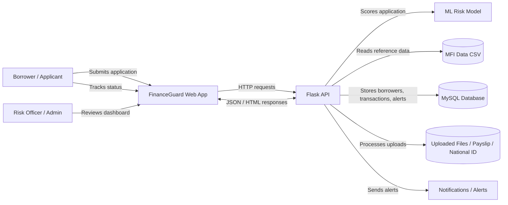
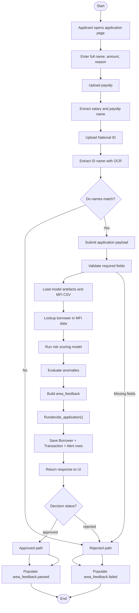
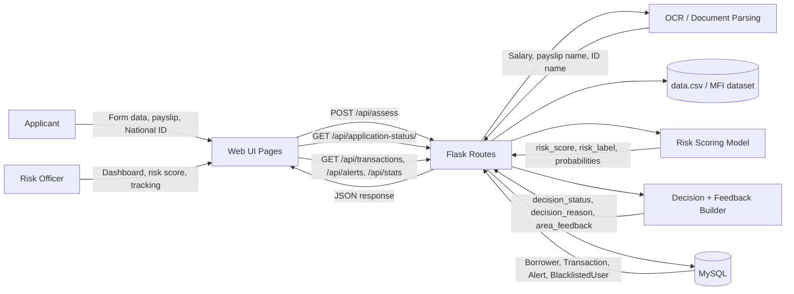
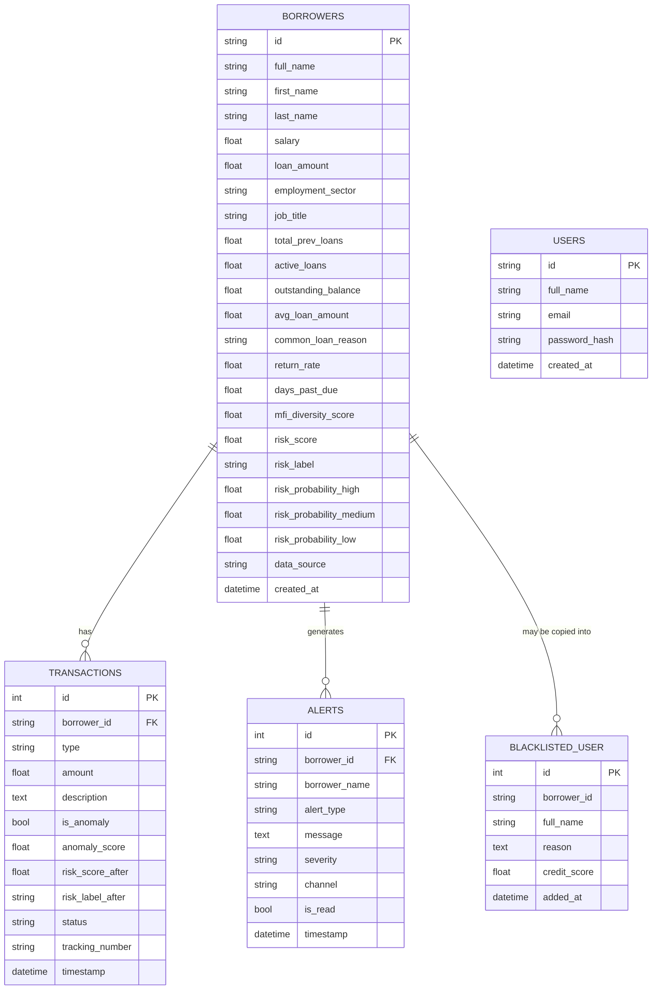
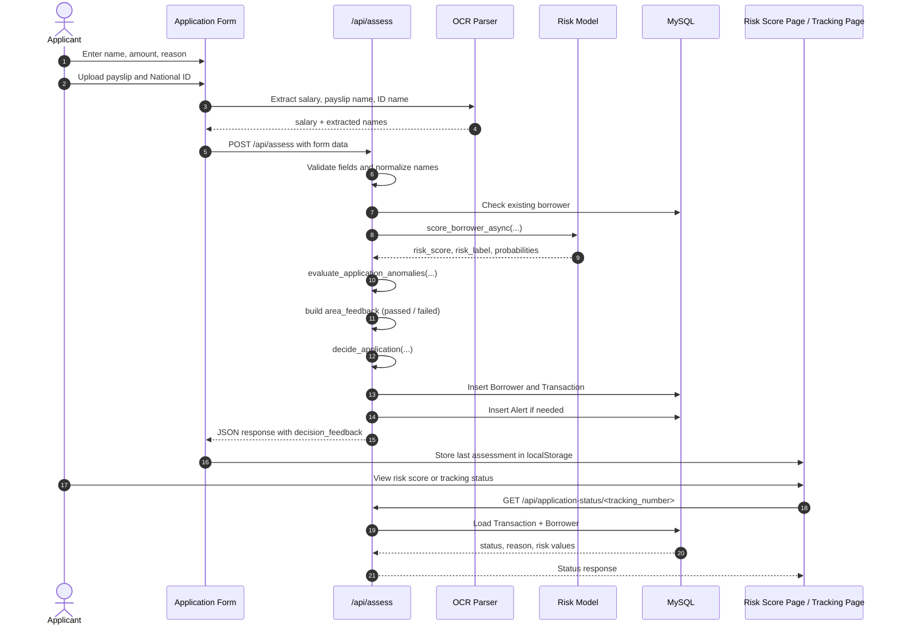

# FinanceGuard Diagrams

This document captures the current system structure based on the active codebase.

## 1) Context Level Diagram

## 2) Activity Diagram

### Pass / Fail categorization used by the current system

- `area_feedback.failed` is populated from anomaly checks plus a `High` risk label.
- `area_feedback.passed` is populated from every defined area that did not fail.
- The UI renders rejected feedback in the "Areas that need attention" section and approved feedback in the "Areas cleared" section.
- The final API response also returns `decision_feedback.failed` and `decision_feedback.passed`.

## 3) Data Flow Diagram

## 4) ERD Diagram

## 5) Sequence Diagram

